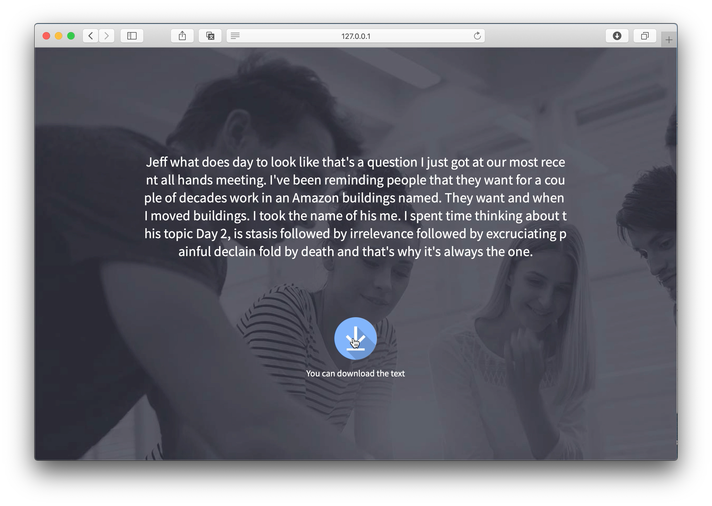

# 프로젝트명: AI 기반 자동 회의록 분석 솔루션, IMAP

## [1] 프로젝트 개요
정례 회의, 부서 회의, 팀별 회의, 긴급 회의, 오전 회의, 오후 회의 … 회사 생활은 사실 회의의 연속이라고 해도 과언이 아닙니다. 회의는 일의 진행상황을 전체가 공유함으로써 일의 효율을 높이는 것이 목적이지만, 회의 기록을 매번 작성하고 분석하는 과정에서 본연의 목적이 전도되는 상황이 더 많습니다.  저희 IMAP은 수없이 진행되는 많은 구두 회의를 기록하고 분석하는 것에 지친 이들을 위해 AI 기반 토탈 솔루션을 제시합니다. 3가지의 핵심 인공지능 기술로 구현된 IMAP을 통해 사용자는 낭비되는 시간과 자원을 대폭 줄이며 업무의 효율성을 극대화할 수 있습니다.

## [2] 핵심 인공지능, 머신러닝 기술
- Microsoft Azure Speech to Text
- LDA(Latent Dirichlet Allocation) Topic Modeling
- ScikitLearn Euclidean distance

## [3] 순서도

## [4] 구현 기능
### 회의 음성 텍스트 변환
현재 진행 중인 회의 내용을 웹 기반의 플랫폼에서 실시간으로 녹음, 분석하여 의미 있는 텍스트파일로 변환합니다. 변환된 텍스트 파일은 Azure의 MySQL 데이터베이스에 안전하게 저장되어, 목적에 따라 다양한 확장자로 내보내기가 가능합니다.

### 문서 별 주제 탐색 및 시각화 분석
수많은 텍스트 기반의 데이터를 빠르게 분석하여 중요한 주제를 모델링합니다. 이러한 분석 결과를 사용자의 요구에 따라 시각적 툴로 표현하여, 복잡한 전처리 과정을 줄이고 손쉽게 분석할 수 있도록 합니다.

### 유사 문서 탐색
정규화하여 계산된 문서 간의 유클리디언 거리를 통해, 사용자는 입력한 문서와 가장 유사하다고 판단되는 문서를 정확하고 빠르게 찾아 비교, 분석할 수 있습니다.

## [5] 학습 및 검정을 위해 사용된 데이터
1. [Microsoft Annual Reports, Proxies and Letter to shareholders](https://www.microsoft.com/en-us/Investor/annual-reports.aspx)
2. [Amazon Annual Reports, Proxies and Letter to shareholders](https://ir.aboutamazon.com/annual-reports)
> 위 보고서를 직접 음성으로 바꾸어 Speech to Text의 기반 데이터로 삼았습니다.

## [6] 사용 도구
1. DB: Microsoft Azure MySQL
2. API: Microsoft Azure Cognitive Services STT
3. AWS EC2, Jupyter notebook, Flask, Github

## [7] 데모 실행 결과
### Speech to Text

### Bubble Graph

### Dominant Topic Table

### Word Cloud

### Word Count and Importance of Topic Keywords

### Number of Documents by Dominant Topic

### Number of Documents by Topic Weightage

## [8] Team member	
*  **Olga Chernyaeva** ([misslelka](https://github.com/misslelka))
*  **김수민** ([09superm](https://github.com/09superm))
*  **손창영** ([cyson1992](https://github.com/cyson1992))
*  **이세진** ([vision20400](https://github.com/vision20400))
*  **박재성** ([jaeseongDev](https://github.com/jaeseongDev))
